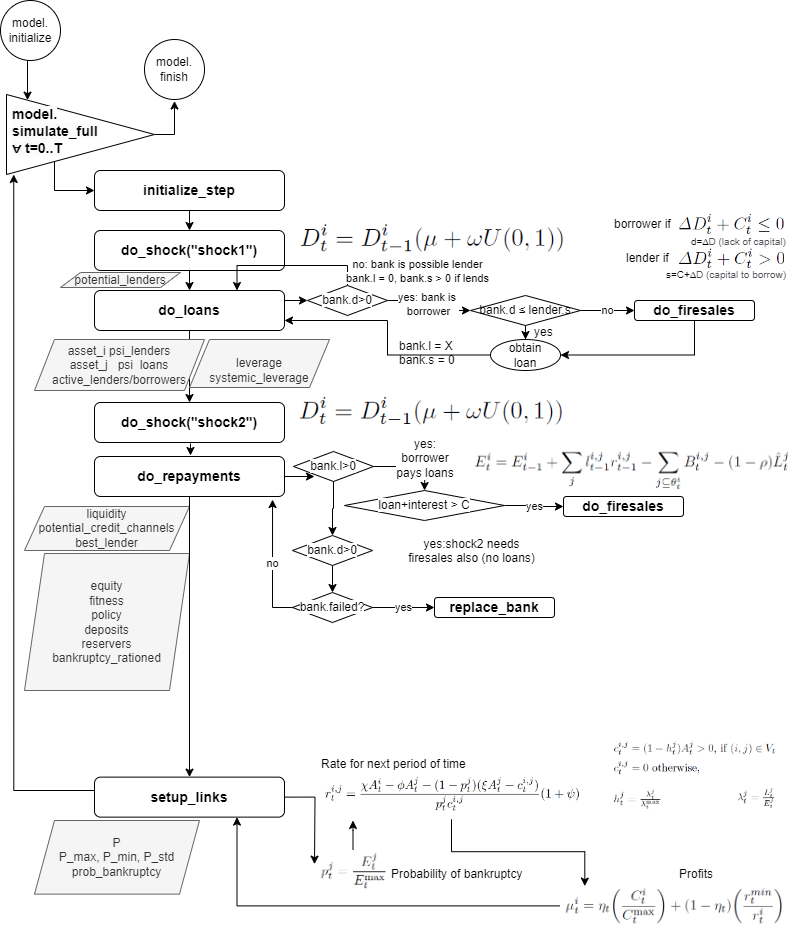

# Auxiliary files

- `requirements.txt`: list of the necessary python packages

# Interbank model

- `interbank.py`: use to execute standalone the Interbank simulation.

  - It accepts command line options. For instance:

    ``` {.bash language="bash" basicstyle="\\ttfamily\\small"}
    interbank.py --log DEBUG --n 150 --t 2000
    interbank.py --save results.gdt --p 0.5 eta=0.35 param=X
    ```

  - When it is used as a package, the sequence should be:

    ``` {.python language="Python" basicstyle="\\ttfamily\\small"}
    import interbank
    model = interbank.Model()
    model.config.configure( param=x )
    model.forward()
    μ = model.get_current_fitness()
    model.set_policy_recommendation( ŋ=0.5 )
    ```

- Basic options:

  ``` {.bash language="bash" basicstyle="\\ttfamily\\small"}
  # To list all options:
  interbank.py --help

  # Using lender's change mechanism ShockedMarket3 with probability of attachment 0.3:
  interbank.py --lc ShockedMarket3 --p 0.3

  # Same for Preferential with m nodes:
  interbank.py --lc Preferential --m 0.3

  # To use a fastest algorithm to run in big simulations:
  interbank.py --fast

  # To run a simulation based on exp_runner:
  python -m experiments.exp_shockedmarket --do
  ```

- `colab_interbank.ipynb`: Notebook version of the standalone
  `interbank.py` with the same results but plotted using Bokeh.

- `interbank_lenderchange.py`: It contains the different algorithms that
  control the change of lender in the model.

- `exp_runner.py`: A prototype for executing experiments with different
  parameters and using MonteCarlo (using concurrent.futures to allow
  multiple threads).

- `exp_runner_distributed.py`: A sub-prototype that uses ray library to
  execute in a cluster.

- `exp_runner_no_concurrent.py`: Another sub-prototype that avoids the
  use of parallelism.

- `exp_runner_no_concurrent.py`: Another sub-prototype that avoids the
  use of parallelism.

- `exp_runner_comparer.py`: A derivation of the former prototype though
  to compare the evolution with `p` (probability of attachment in an
  Erdos-Renyi graph) in the `x` axis and other parameters accross the
  `y` axis.

- `exp_runner_surviving.py`: A derivation of the former prototype using
  ray library to execute in a cluster.

- `experiments/`: directory with all the experiments conducted. The
  results of that executions are stored in a folder determined inside
  each experiment.

- `utils/plot_psi.py`: Generate a table of axis_x x axis_y plots.

- `utils/labplot2_interbank.lml`: [LabPlot2](https://labplot.org/) file
  to plot the results of the `interbank.py`. By the way the best way is
  to use [Gretl](https://gretl.sourceforge.net/) as an export format.

- `algorithm.drawio` and `algorithm.drawio.pf`: the
  [draw.io](https://www.drawio.com/) and PDF schema of the algorithm
  used in the model to propagate shocks and to balance sheets.

# RL with Stable Baselines3

- `interbank_agent.py`: agent to test using PPO

- `run_ppo.py`: run and simulate with PPO agent

- `run_td3.py`: run and simulate with TD3 algorithm

- `models/XXXX.zip`: instances of Gymnasium.env trained to use with
  `run_XXXX.py`

- `utils/plot_ppo.py`: auxiliary creator of plots to play the results of
  PPO

- Usage:

  ``` {.bash language="bash" basicstyle="\\ttfamily\\small"}
  # train first and save the model env:
  run_ppo.py --train ppo_10000 --t 10000 --verbose

  # use the trained env and generate a simulation of T=1000 with Interbank model
  run_ppo.py --load ppo_10000 --save results_ppo.txt
  ```

# Basic usage of the model

<figure id="fig:algorithm" data-latex-placement="htb">

<figcaption>Flujo del modelo interbancario: shocks, préstamos, repagos y
ventas forzosas</figcaption>
</figure>

- `interbank_agent.py`: agent to test using PPO

- Usage:

::: tabular
\|l\|c\|r\| Name & Explanation & Global & **stats_market** & Individual
& Graphs\
**gcs** & bla bla & & & & $\checkmark$\
**gcs** & bla bla & & & & $\checkmark$\
:::
